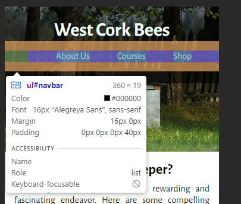

# West Cork Beekeeping

This website is designed to be responsive for users visiting on different-sized devices. It enables users to learn about bees and beekeeping and encourages visitors to register for beekeeping courses.

Live website on Github Pages: [West Cork Beekeeping](https://simonhw.github.io/beekeeping/index)

 

## Contents
- [User Experience](#User-Experience)
    - [Initial Discussion](#Initial-Discussion)
    - [User Stories](#User-Stories)
- [Deployment](#Deployment)
  - [Local Deployment](#Local-Deployment)
    - [Forking](#Forking)
    - [Cloning](#Cloning)
- [Credits](#Credits)
- [Acknowledgements](#Acknowledgements)

## User Experience

### Initial Discussion
West Cork Beekeeping is a site that promotes interest in beekeeping in the West Cork area. The goal of the site is to generate interest in the environmental importance of the honey bee and encourage visitors to the site to register for beekeeping courses run by the owners of the website. The owners raise funding to keep promoting awareness of the honey bee by running for-profit training courses and selling a small range of relevant products. 

### User Stories

#### First-time Visitor Goals
* To understand what the purpose of the website is.
* To easily navigate between the pages and find what I'm looking for.
* To be able to contact the owners of the website for more information.

#### Returning Visitor Goals
* To be able to easily locate information previously found.
* To find up to date information on beekeeping courses.
* To find out where the website owners are based.
* To be able to purchase beekeeping equipment I need.

#### Frequent Visitor Goals
* To be able to purchase honey when I need to.

## Deployment

Github Pages was used to deploy the live version of the website. The steps followed to do this were as follows:
  1. Log in or sign up to Github.
  2. Navigate to the repository for [West Cork Beekeeping](https://github.com/simonhw/beekeeping).
  3. Click the Settings link near the top of the page.
  4. Click on the Pages link on the left-hand side under Code and Automation.
  5. Under Build and Deployment click the dropdown menu for Branches and select 'main'. For the Folder dropdown menu, select 'root'.
  6. Click Save to deploy the website on Github Pages.

### Local Deployment
To deploy this project locally on your own device, follow the below steps:
#### Forking 
1. Log in or sign up to Github.
2. Navigate to the repository for [West Cork Beekeeping](https://github.com/simonhw/beekeeping).
3. Click the Fork button located in the top right part of the webpage.
#### Cloning
1. Log in or sign up to Github.
2. Navigate to the repository for [West Cork Beekeeping](https://github.com/simonhw/beekeeping).
3. Click on the green Code button and select your preferred option of HTTPS, SSH, or GitHub CLI and copy the relevant link.
4. Open the terminal in your IDE and navigate to your directory of choice for this new clone.
5. Type `git clone` into the terminal and paste in your copied link. Press enter.

## Running Tests

### Automated Testing
[W3C](https://validator.w3.org/) was used to validate the HTML on all website pages and the CSS stylesheet.
- [index.html](https://github.com/simonhw/beekeeping/blob/main/assets/images/readme/testing/w3c-index.png) - Passed.
- [courses.html](https://github.com/simonhw/beekeeping/blob/main/assets/images/readme/testing/w3c-courses.png) - Passed.
- [shop.html](https://github.com/simonhw/beekeeping/blob/main/assets/images/readme/testing/w3c-shop.png) - Passed.
- [form.html](https://github.com/simonhw/beekeeping/blob/main/assets/images/readme/testing/w3c-form.png) - Passed.
- [thankyou.html]()
- [404.html]()
- [style.css](https://github.com/simonhw/beekeeping/blob/main/assets/images/readme/testing/w3c-css.png) - Passed with no errors.

### Lighthouse
The Lighthouse feature in Chrome Developer Tools was used to test the performace, accessibility, best practices, and search engine optimisation of the website.

#### Desktop 
#### Mobile

## Bugs
### Known Bugs
### Solved Bugs
| # | Bug | Image | Solution |
| --- | --- | --- | --- |
| 1 | While creating the nav bar, there was an inexplicable left padding of 40px which pushed the nav links off center when using flex properties. |  | The solution was to force all padding for the element to 0px in the CSS code. |
|2|The first element in the header, the div containing the navbar, had a non-zero value for margin-top. This pushed the entire header down leaving a white space in height equal to the previous margin-top value. | |Adding the property 'overflow:hidden' to the div resolved the problem. Solution found on stack overflow here: https://stackoverflow.com/questions/2680478/margin-top-push-outer-div-down |
|3|h1 was being pushed off header on wider screen widths | |i utilised flex grow and also setting a minimum height for the header. |

## Credits

### Code Used
Code for the website footer was copied and adapted from the Code Institute Love Running Walkthrough Project.
- [Code Institute - Creating the Footer](https://github.com/Code-Institute-Solutions/love-running-v3/tree/main/3.7-creating-the-footer)

### Content
All code content was written by Simon Henleywillis unless otherwise specified above.

Paragraph text content was generated by ChatGPT and either used as-is or edited by Simon Henleywillis. 

ChatGPT Prompts: [Beekeeping: A Buzzing Hobby](https://chat.openai.com/c/bfaa4756-e755-4300-8aa0-5cff9b9cc20b) ~ [Bee Importance Unveiled](https://chat.openai.com/c/f0fd6c9d-5851-4e78-9275-83b556ab52e9) ~ [Irish Honey Bee Info](https://chat.openai.com/c/a34d83b8-4d55-42c0-b478-e94abeb4d8de)

### Media
All images were found on [Pexels](https://www.pexels.com/) and [Unsplash](https://unsplash.com/license). The Pexels website states that "*All photos and videos on Pexels can be downloaded and used for free*" and Unsplash states "*Unsplash photos are made to be used freely. Our license reflects that.*".

- Header Image: [A Beehive in the Garden](https://www.pexels.com/photo/a-beehive-in-the-garden-18014793/)
- Index Page: [Three People in White Suit](https://www.pexels.com/photo/three-people-in-white-suit-2260935/) ~ [A bee is sitting on top of a pink flower](https://www.pexels.com/photo/a-bee-is-sitting-on-top-of-a-pink-flower-17619735/) ~ [Man harvesting honey in apiary with bees](https://www.pexels.com/photo/man-harvesting-honey-in-apiary-with-bees-5247943/) ~ [Honey in Jars on Shelves](https://www.pexels.com/photo/honey-in-jars-on-shelves-12370134/)
- Courses Page: [Women Standing on the Grass While Holding a Bucket](https://www.pexels.com/photo/women-standing-on-the-grass-while-holding-a-bucket-2260936/) ~ [Close-up of a Honeycomb Filled with Honey](https://www.pexels.com/photo/close-up-of-a-honeycomb-filled-with-honey-11655535/) ~ [Bees on Purple Flower](https://www.pexels.com/photo/bees-on-purple-flower-164470/) ~ [Crop man harvesting honey in countryside area](https://www.pexels.com/photo/crop-man-harvesting-honey-in-countryside-area-5247947/)
- Shop Page: [Honey on Glass Jars](https://www.pexels.com/photo/honey-on-glass-jars-13246534/) ~ [bee person planting](https://unsplash.com/photos/bee-person-planting-8_WZU5xKFKk) ~ [Beehives on a Grass Field](https://www.pexels.com/photo/beehives-on-a-grass-field-17543926/) ~ [A Man in a Beekeeper Suit Near Blue Wooden Crates](https://www.pexels.com/photo/a-man-in-a-beekeeper-suit-near-blue-wooden-crates-4505623/) ~ [Close-Up Photo of an Empty Glass Jar on a White Surface](https://www.pexels.com/photo/close-up-photo-of-an-empty-glass-jar-on-a-white-surface-7604265/)