# West Cork Beekeeping

This website is designed to be responsive for users visiting on different-sized devices. It enables users to learn about bees and beekeeping and encourages visitors to register for beekeeping courses.

Live website on Github Pages: [West Cork Beekeeping](https://simonhw.github.io/beekeeping/index)

 

## Contents
- [User Experience](#User-Experience)
    - [Initial Discussion](#Initial-Discussion)
    - [User Stories](#User-Stories)
- [Design](#Design)
    - [Colour Scheme](#Colour-Scheme)
    - [Typography](#Typography)
    - [Imagery](#Imagery)
    - [Wireframes](#Wireframes)
    - [Features](#Features)
    - [Accessibility](#Accessibility)
- [Technologies Used](#Technologies-Used)
  - [Languages](#Languages)
  - [Frameworks, Libraries, and Programs](#Frameworks,-Libraries,-and-Programs)
- [Deployment](#Deployment)
  - [Local Deployment](#Local-Deployment)
    - [Forking](#Forking)
    - [Cloning](#Cloning)
- [Testing](#Testing)
  - [Manual Testing](#Manual-Testing)
  - [Full Testing](#Full-Testing)
  - [Automated Testing](#Automated-Testing)
  - [Lighthouse](#Lighthouse)
- [Bugs](#Bugs)
- [Credits](#Credits)
  - [Code Used](#Code-Used)
  - [Content](#Content)
  - [Media](#Media)
- [Acknowledgements](#Acknowledgements)

## User Experience

### Initial Discussion
West Cork Beekeeping is a site that promotes interest in beekeeping in the West Cork area. The goal of the site is to generate interest in the environmental importance of the honey bee and encourage visitors to the site to register for beekeeping courses run by the owners of the website. The owners raise funding to keep promoting awareness of the honey bee by running for-profit training courses and selling a small range of relevant products. 

### User Stories

#### First-time Visitor Goals
* To understand what the purpose of the website is.
* To easily navigate between the pages and find what I'm looking for.
* To be able to contact the owners of the website for more information.

#### Returning Visitor Goals
* To be able to easily locate information previously found.
* To find up to date information on beekeeping courses.
* To find out where the website owners are based.
* To be able to purchase beekeeping equipment I need.

#### Frequent Visitor Goals
* To be able to purchase honey when I need to.

## Design
### Colour Scheme
The website uses a palette of simple colours inkeeping with its minimalist design, loosely inspired by the colours found on the body of the honey bee.

### Typography
An imported Google Font, Alegreya Sans, was used for this website. Font weights of 400 and 700 were chosen for standard and bold text options. This particular font was chosen as it evoked feelings of a friendly and welcoming nature. 

### Imagery
Imagery was chosen that showed beekeepers working with the types of equipment that users would expect to see if they enrol in a beekeeping course. It was difficult to find free-to-use images that showed environment reflecting the local climate of West Cork, so this was rated as a lower priority characteristic compared to finding images that showed people enjoying themselves and that were different enough from each other to not have to repeat any across the site.

### Wireframes
Some basic wireframes were created for desktop and mobile for the the homepage. This gave a basic starting point from which the greater website then took shape. The original ideas were adapted and evolved as coding progressed thoughtout the project timeline. 

### Features
The website is comprised of six pages. Three are accessible from the main navigation bar: the Home page, Courses page, and Shop Page. The fourth is the Form page, accessible via the call to action button at the bottom of each of the above three pages, and also via links in the list of available courses. The Fifth page is the Thank You page which the user sees once they complete the form itself. The sixth and final page is a 404 page.

#### All pages on the website have:
- A favicon of a honey bee.

- A navigation bar at the top allowing the user to move between the three main pages. As there are only three pages, the same format is used for the navigation bar on mobile screens. It was decided that the use of a dropdown menu by clicking a burger icon detracted from the aesthetic look of the header with its background image and centred heading.

- A footer at the bottom of the page containing three icon links to a phone number, email, and Google Maps location. This was determined to be more beneficial to the user than social media links and tied in well with the goals of the website to encourage users to get in touch and register for beekeeping courses.

#### The Home page
- A heading welcomes the user to the site followed by a summary of the motivation and intentions of the website owners. This immediately gives the user an idea of what to expect from the rest of the website. A picture of three beekeepers posing in their suits conveys a sense of fun and camaraderie to the user.

- A section briefly describes the role honey bees play in the environment and the challenges currently faced by them. This section ends with a call-to-action of sorts and places at the front of the user's mind the idea that becoming a beekeeper is a noble and worthwhile pursuit. A closeup image of a bee collecting nectar from a flower is nestled between the two paragraphs of this section. Its bright colours and focus on the bee itself should evoke thoughts about the beauty and importance of the honey bee in nature while also making the user think about its fragility as a small creature worthy of our care.

- A third and final section consists of two sets of short descriptive sentences and associated images and headings. These two sections invite the user to either navigate to the Courses page to learn more about the beekeeping courses, or to visit the Shop page to purchase honey. The images are the links, and when viewed on mobiles and tablets, the final sentence says "*Tap the image to learn more*", while on desktops it says "*Click the image the learn more*". This was achieved with the use of spans.
- At the bottom of this page and the two other main pages, a call-to-action link takes the user directly to the Form page to register for a beekeeping course. This link allows a returning user to navigate directly to the registration form without having to click other links to get there. The yellow colour was chosen to draw attention to the user that it is something distinct from other content on this page.

#### The Courses page
- The first section lists the two different levels of courses offered. Beginner courses are listed first with information on the duration and times the courses start. An overview of the structure of the courses follows with distinct boxes listing upcoming courses. The most recent sold out courses at each level are still shown on this page to convey to the user that there is already interest and that they should not delay in booking their place. The Intermediate course information is presented next with the same structure as described above. These sections will be updated as time goes on to keep user up to date with availibility.

- A second section aims to convince the undecided user that they should register their interest in an upcoming course. Four reasons to become a beekeeper are listed with accompanying imagery chosen to invoke thoughts of fun, relaxation, peacefulness, and enjoyment.
- A final paragraph reminds the user that becoming a beekeeper requires time and effort but reassures them that it is a worthwhile endeavour.

#### The Shop page
- An introductory paragraph informs the user of the payment process for products on this page as well as delivery terms and discounts for course graduates. A contact number and email are listed distinct from each other below the paragraph to offer the returning user quick access should they desire to contact the owners.

- Boxes show the available products and short descriptions with accompanying imagery. These boxes will be displayed in single or multiple columns based on the screen width of the user.

#### The Form page
- A simple layout seeks only the minimum necessary information from the user. This style of layout is intended to make the user experience straightforward and quick, as very few people want to spend time filling out multiple form fields.
- The input fields only accept the expected type of input; the date of birth field does not allow a user under the age of 18 to register.
- Radio buttons limit the user to only registering for one available course at a time. The next available beginner course is selected by default.
- A button underneath the fieldset submits the user's details when clicked; however, it will only allow the user to do so if they have completed all the input fields correctly. If any information is missing or the format is incorrect, the website will direct the user to the problem area.

#### The Thank You page
- The Thank You page is intended to confirm to the user that their information has been received and informs them of an acknowledgement email they will receive. This page will automatically redirect to the homepage after 10 seconds and the user is informed of this. Should this redirect fail for any reason, the user is instructed to use the nav bar links to get back to the main website.

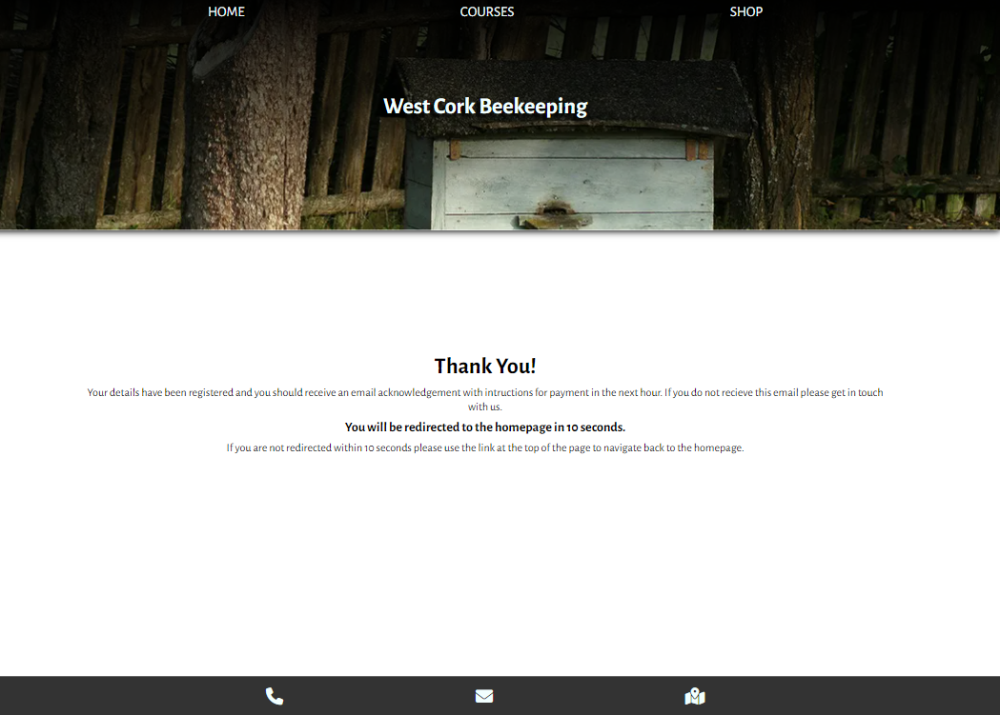

#### The 404 page
- The customised 404 page is included in the root folder for fun. The cartoon beehive was edited in Adobe Photoshop to include two 4's in the Alegreya Sans font. This gives the effect of '404' when combined with the hole in the beehive.

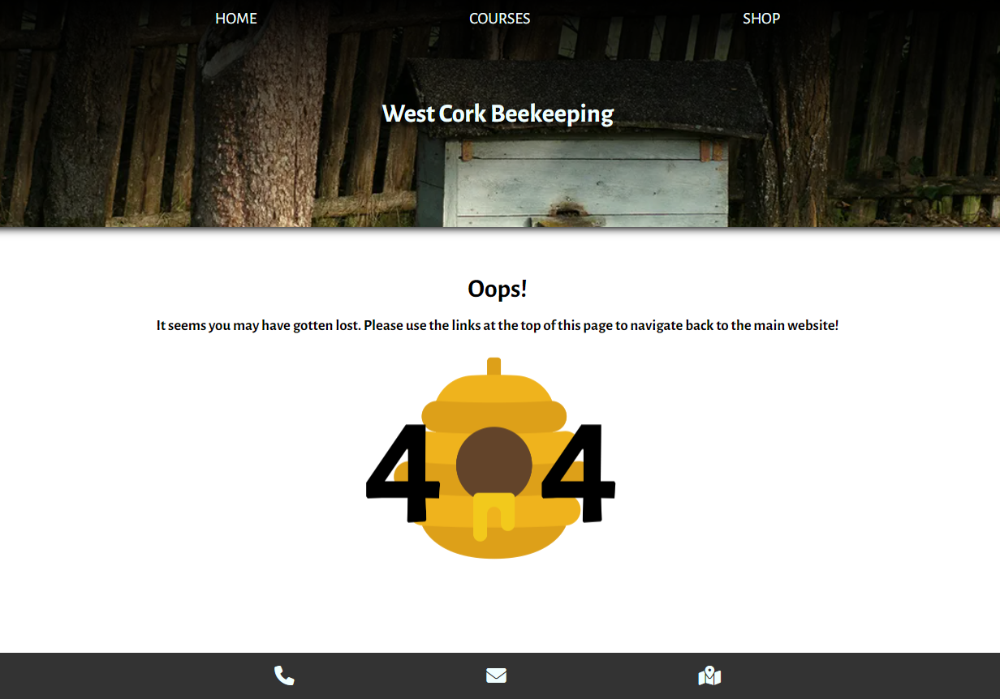

#### Features To Be Implemented
- Add mouse hover effect on laptop and dekstop screens: CSS styling will darken the two images at the bottom of index.html and display white text above the darkened area saying "*Learn more about courses*" and "*Browse our shop*" respectively for both images.
- Upgrade the Courses page to allow direct booking of and payment for availble courses.
- Upgrade the Shop page to allow direct ordering and payment via the website.

### Accessibility
When creating this website, I kept accessibility in mind by:
- Using semantic html elements throughout the website.
- Using colours with good contrast to the background.
- Including clearly descriptive alt attributes for all images on the site.
- Using aria labels to describe the actions that would be taken when interacting with links that contain no text. These can be found in the two image links at the bottom of index.html and in the footer icons link on every page.

## Technologies Used
### Languages
HTML, CSS

### Frameworks, Libraries, and Programs
Balsamiq - To create wireframes.

Visual Studio Code - The IDE used to write my code.

Chrome Developer Tools - To visualise and test changes to the code and styling.

Git - For version control.

Github - To save and store files online.

Google Fonts - For imported fonts used on the website.

[Font Awesome](https://fontawesome.com/) - For icons used in the footer.

[Favicon.io](https://favicon.io/) - To source the favicon used.

[Pexels.com](https://www.pexels.com/), [Unsplash.com](https://unsplash.com/), and [Flaticon](https://www.flaticon.com/) - To source images used on the website.

Adobe Photoshop 2020 - To crop and resize images.

[TinyPNG](https://tinypng.com/) - To compress images.

Shutter Encoder  - To convert images to .webp format.

Github Pages - To host the live version of the website.

[Am I Responsive?](https://ui.dev/amiresponsive) - To showcase the website on different screen sizes for this README.

[Shields.io](https://shields.io/) - To add badges to this README.

[Coolors](https://coolors.co/) - To showcase the colour palette of the website.

## Deployment

Github Pages was used to deploy the live version of the website. The steps followed to do this were as follows:
  1. Log in or sign up to Github.
  2. Navigate to the repository for [West Cork Beekeeping](https://github.com/simonhw/beekeeping).
  3. Click the Settings link near the top of the page.
  4. Click on the Pages link on the left-hand side under Code and Automation.
  5. Under Build and Deployment click the dropdown menu for Branches and select 'main'. For the Folder dropdown menu, select 'root'.
  6. Click Save to deploy the website on Github Pages.

### Local Deployment
To deploy this project locally on your own device, follow the below steps:
#### Forking 
1. Log in or sign up to Github.
2. Navigate to the repository for [West Cork Beekeeping](https://github.com/simonhw/beekeeping).
3. Click the Fork button located in the top right part of the webpage.
#### Cloning
1. Log in or sign up to Github.
2. Navigate to the repository for [West Cork Beekeeping](https://github.com/simonhw/beekeeping).
3. Click on the green Code button and select your preferred option of HTTPS, SSH, or GitHub CLI and copy the relevant link.
4. Open the terminal in your IDE and navigate to your directory of choice for this new clone.
5. Type `git clone` into the terminal and paste in your copied link. Press enter.

## Testing
### Manual Testing

| User Stories | Achieved by: | Supporting Images |
| --- | --- | --- |
| **First-time Visitors** | | |
| To understand what the purpose of the website is. | The main heading of "West Cork Beekeeping" communicates the location and activity presented by the website without any ambiguity. The nav bar contains links for "Courses" and "Shop" which immediately communicate to the user that the website offers services. The final section on the home page invites the user to either enrol in a course or browse the shop. | [Navbar and Heading Image](assets/images/readme/navigation-bar.PNG)|
| To easily navigate between the pages and find what I'm looking for. | The nav bar is present on each page and does not change in style. The links are succinctly named "Home", "Courses", and "Shop". | |
| To be able to contact the owners of the website for more information. | The footer offers the user the option to ring or email the owners at the tap of a button. This footer is present on each page. The phone number and email are listed on the Shop page and these links open in a phone app and email app respectively when clicked. | [Footer Icons Image](assets/images/readme/footer.PNG) |
| **Returning Visitors** | | |
| To be able to easily locate information previously found. | Each page of the website has its content clearly separated into sections with headings. | |
| To find up to date information on beekeeping courses. | The course page lists the upcoming courses clearly and is updated as the courses become booked out. | [Courses Image](assets/images/readme/section-courses.PNG) |
| To find out where the website owners are based. | The footer contains a map icon link to show the location of the beekeeping group on Google Maps. | |
| To be able to purchase beekeeping equipment I need. | The Shop page shows relevant products for the prospective beekeper and large images draw the attention of the user to their item of interest. | [Products Image](assets/images/readme/section-products.PNG) |
| **Frequent Visitors** | | |
| To be able to purchase honey when I need to. | The Shop link is immediately available to the user in the nav bar. At the bottom of the home page there is an image of honey jars on shelves which when clicked brings the user to the Shop page. The first product listed is the honey. | [Honey Link Image](assets/images/readme/invite-honey.PNG) |

### Full Testing
The website was fully tested on a Windows 10 desktop with a 26" monitor and a One Plus 9 Pro. Other types of devices were tested using Chrome Developer Tools.

The site was tested on Google Chrome, Edge, and Mozilla Firefox on the desktop, and Google Chrome and DuckDuckGo on the One Plus 9 Pro.

#### Index Page
| Feature | Expected Outcome | Test Used | Result | Test Status |
| --- | --- | --- | --- | --- |
| Navbar home link | When clicked, the user is redirected to the home page | Link clicked | Redirected to home page | Pass |
| Navbar courses link | When clicked, the user is redirected to the courses page | Link clicked | Redirected to courses page | Pass |
| Navbar shop link | When clicked, the user is redirected to the shop page | Link clicked | Redirected to shop page | Pass |
| Beekeeping Courses image link | When clicked, the user is redirected to the courses page | Image clicked | Redirected to courses page | Pass |
| Local Honey image link | When clicked, the user is redirected to the shop page | Image clicked | Redirected to shop page | Pass |
| Call-to-Action Sign Up Button link | When clicked, the user is redirected to the form page | Button link clicked | Redirected to form page | Pass |
| Footer Phone icon | When clicked, the user is redirected to a phone app or program with the number autofilled | Icon clicked | Phone app opened with number autofilled | Pass |
| Footer Email icon | When clicked, the user is redirected to an email app with the email address populated in the To: field | Icon clicked | Email app opened with email in To: field | Pass |
| Footer Map icon | When clicked, the user is redirected to a Google Maps location in a new tab or app | Icon clicked | Google Maps open in a new tab or app | Pass |

#### Courses Page
| Feature | Expected Outcome | Test Used | Result | Test Status |
| --- | --- | --- | --- | --- |
| Navbar home link | When clicked, the user is redirected to the home page | Link clicked | Redirected to home page | Pass |
| Navbar courses link | When clicked, the user is redirected to the courses page | Link clicked | Redirected to courses page | Pass |
| Navbar shop link | When clicked, the user is redirected to the shop page | Link clicked | Redirected to shop page | Pass |
| Places Available Link 1 |  When clicked, the user is redirected to the form page | Link clicked | Redirected to form page | Pass |
| Places Available Link 2 |  When clicked, the user is redirected to the form page | Link clicked | Redirected to form page | Pass |
| Places Available Link 3 |  When clicked, the user is redirected to the form page | Link clicked | Redirected to form page | Pass |
| Call-to-Action Sign Up Button link | When clicked, the user is redirected to the form page | Button link clicked | Redirected to form page | Pass |
| Footer Phone icon | When clicked, the user is redirected to a phone app or program with the number autofilled | Icon clicked | Phone app opened with number autofilled | Pass |
| Footer Email icon | When clicked, the user is redirected to an email app with the email address populated in the To: field | Icon clicked | Email app opened with email in To: field | Pass |
| Footer Map icon | When clicked, the user is redirected to a Google Maps location in a new tab or app | Icon clicked | Google Maps open in a new tab or app | Pass |

#### Shop Page
| Feature | Expected Outcome | Test Used | Result | Test Status |
| --- | --- | --- | --- | --- |
| Navbar home link | When clicked, the user is redirected to the home page | Link clicked | Redirected to home page | Pass |
| Navbar courses link | When clicked, the user is redirected to the courses page | Link clicked | Redirected to courses page | Pass |
| Navbar shop link | When clicked, the user is redirected to the shop page | Link clicked | Redirected to shop page | Pass |
| Phone number link | When clicked, the user is redirected to a phone app or program with the number autofilled | Link clicked | Phone app opened with number autofilled | Pass |
| Email link | When clicked, the user is redirected to an email app with the email address populated in the To: field | Link clicked | Email app opened with email in To: field | Pass |
| Call-to-Action Sign Up Button link | When clicked, the user is redirected to the form page | Button link clicked | Redirected to form page | Pass |
| Footer Phone icon | When clicked, the user is redirected to a phone app or program with the number autofilled | Icon clicked | Phone app opened with number autofilled | Pass |
| Footer Email icon | When clicked, the user is redirected to an email app with the email address populated in the To: field | Icon clicked | Email app opened with email in To: field | Pass |
| Footer Map icon | When clicked, the user is redirected to a Google Maps location in a new tab or app | Icon clicked | Google Maps open in a new tab or app | Pass |

#### Form Page
| Feature | Expected Outcome | Test Used | Result | Test Status |
| --- | --- | --- | --- | --- |
| Navbar home link | When clicked, the user is redirected to the home page | Link clicked | Redirected to home page | Pass |
| Navbar courses link | When clicked, the user is redirected to the courses page | Link clicked | Redirected to courses page | Pass |
| Navbar shop link | When clicked, the user is redirected to the shop page | Link clicked | Redirected to shop page | Pass |
| Name Input Field | When clicked, an autocomplete option appears. | Field clicked | Autocomplete box appears | Pass |
| Name Input Field | When text is entered by the user, the placeholder text disappears. | Text entered by user | Placeholder text disappears | Pass |
| Name Input Field | If the user attempts to submit the form with this field left blank, the user is prompted to enter some text into the field before continuing. | Submit button clicked with input field left blank. | Form does not submit and an alert reminds the user to enter text into the input field. | Pass |
| Email Input Field | When clicked, an autocomplete option appears. | Field clicked | Autocomplete box appears | Pass |
| Email Input Field | When text is entered by the user, the placeholder text disappears. | Text entered by user | Placeholder text disappears | Pass |
| Email Input Field | If the user attempts to submit the form with this field left blank, the user is prompted to enter some text into the field before continuing. | Submit button clicked with input field left blank. | Form does not submit and an alert reminds the user to enter text into the input field. | Pass |
| Email Input Field | If the user attempts to submit the form with this text in this field that is missing a @ symbol, the user is prompted to add an @ to the text before continuing. | Submit button clicked with text not including the @ symbol in the input field. | Form does not submit and an alert reminds the user to add a @ symbol to the text in the input field. | Pass |
| Email Input Field | If the user attempts to submit the form with no text after the @ symbol, the user is prompted to add text after the @ symbol before continuing. | Submit button clicked with no text present after the @ symbol in the input field. | Form does not submit and an alert reminds the user to add text after the @ symbol in the input field. | Pass |
| Email Input Field | If the user attempts to submit the form with no text before the @ symbol, the user is prompted to add text before the @ symbol before continuing. | Submit button clicked with no text present before the @ symbol in the input field. | Form does not submit and an alert reminds the user to add text *after* the @ symbol in the input field. | Soft Pass |
| Date of Birth Input Field | When no date is entered by the user, the form will not submit and a reminder to fill in the field will display. | No date entered by user and submit button clicked. | Form does not submit and reminder message displays | Pass |
| Date of Birth Input Field | When an invalid date is entered by the user, the form will not submit and a reminder to enter a date earlier than 07/12/2005 will display. | A date later than 07/12/2005 was entered by user and submit button clicked. | Form does not submit and reminder message displays. | Pass |
| Courses Radio Buttons | When a given course is selected, the previously selected course in unselected | The user clicked each of the radio buttons in turn. | Only one course button was able to selected at any one time. | Pass |
| Submit Button | When clicked, the user is redirected to the Thank You page. | Button clicked | Redirected to Thank You page | Pass |
| Footer Phone icon | When clicked, the user is redirected to a phone app or program with the number autofilled | Icon clicked | Phone app opened with number autofilled | Pass |
| Footer Email icon | When clicked, the user is redirected to an email app with the email address populated in the To: field | Icon clicked | Email app opened with email in To: field | Pass |
| Footer Map icon | When clicked, the user is redirected to a Google Maps location in a new tab or app | Icon clicked | Google Maps open in a new tab or app | Pass |

#### Thank You Page
| Feature | Expected Outcome | Test Used | Result | Test Status |
| --- | --- | --- | --- | --- |
| Navbar home link | When clicked, the user is redirected to the home page | Link clicked | Redirected to home page | Pass |
| Navbar courses link | When clicked, the user is redirected to the courses page | Link clicked | Redirected to courses page | Pass |
| Navbar shop link | When clicked, the user is redirected to the shop page | Link clicked | Redirected to shop page | Pass |
| Footer Phone icon | When clicked, the user is redirected to a phone app or program with the number autofilled | Icon clicked | Phone app opened with number autofilled | Pass |
| Footer Email icon | When clicked, the user is redirected to an email app with the email address populated in the To: field | Icon clicked | Email app opened with email in To: field | Pass |
| Footer Map icon | When clicked, the user is redirected to a Google Maps location in a new tab or app | Icon clicked | Google Maps open in a new tab or app | Pass |

#### 404 Page
| Feature | Expected Outcome | Test Used | Result | Test Status |
| --- | --- | --- | --- | --- |
| Navbar home link | When clicked, the user is redirected to the home page | Link clicked | Redirected to home page | Pass |
| Navbar courses link | When clicked, the user is redirected to the courses page | Link clicked | Redirected to courses page | Pass |
| Navbar shop link | When clicked, the user is redirected to the shop page | Link clicked | Redirected to shop page | Pass |
| Footer Phone icon | When clicked, the user is redirected to a phone app or program with the number autofilled | Icon clicked | Phone app opened with number autofilled | Pass |
| Footer Email icon | When clicked, the user is redirected to an email app with the email address populated in the To: field | Icon clicked | Email app opened with email in To: field | Pass |
| Footer Map icon | When clicked, the user is redirected to a Google Maps location in a new tab or app | Icon clicked | Google Maps open in a new tab or app | Pass |

### Automated Testing
[W3C](https://validator.w3.org/) was used to validate the HTML on all website pages and the CSS stylesheet.
- [index.html](https://github.com/simonhw/beekeeping/blob/main/assets/images/readme/testing/w3c-index.PNG) - Passed. Trailing slashes in self-closing `` elements are flagged as having no effect.
- [courses.html](https://github.com/simonhw/beekeeping/blob/main/assets/images/readme/testing/w3c-courses.PNG) - Passed. Trailing slashes in self-closing `` elements are flagged as having no effect.
- [shop.html](https://github.com/simonhw/beekeeping/blob/main/assets/images/readme/testing/w3c-shop.PNG) - Passed. Trailing slashes in self-closing `` elements are flagged as having no effect.
- [form.html](https://github.com/simonhw/beekeeping/blob/main/assets/images/readme/testing/w3c-form.PNG) - Passed.
- [thankyou.html](https://github.com/simonhw/beekeeping/blob/main/assets/images/readme/testing/w3c-thank-you.PNG) - Passed.
- [404.html](https://github.com/simonhw/beekeeping/blob/main/assets/images/readme/testing/w3c-404.PNG) - Passed. The trailing slash in the self-closing `` element is flagged as having no effect.
- [style.css](https://github.com/simonhw/beekeeping/blob/main/assets/images/readme/testing/w3c-css.PNG) - Passed with no errors and [two warnings](https://github.com/simonhw/beekeeping/blob/main/assets/images/readme/testing/w3c-css-warnings.PNG). The warnings are related to vendor extensions.

### Lighthouse
The Lighthouse feature in Chrome Developer Tools was used to test the performace, accessibility, best practices, and search engine optimisation of the website.

#### Desktop Tests
All tests in desktop mode were satisfactory with scores between 92 and 100.

Index page:
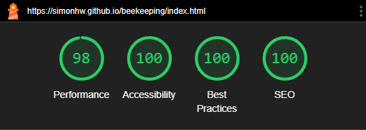

Courses page:
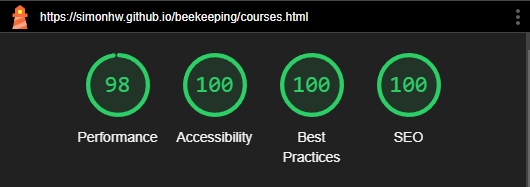

Shop page:
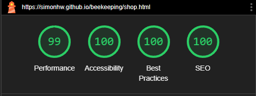

Form page:
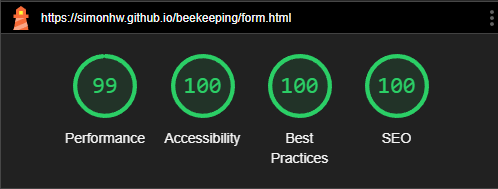

Thank You page:
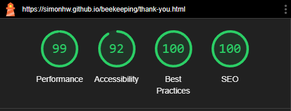

404 page:

#### Mobile Tests
Mobile test were all satisfactory in the Accessibilty, Best Practices, and SEO categories. The Performace scores for mobile were lower than desktop, ranging from 77 to 93. Lighthouse suggested improving this score by sizing images more appropriately.  

Index page:
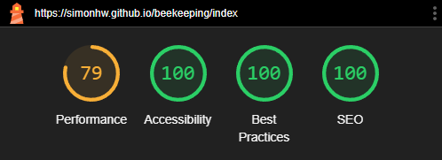

Courses page:
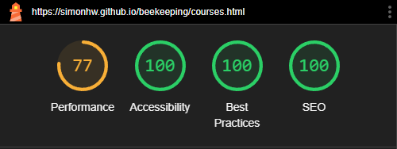

Shop page:
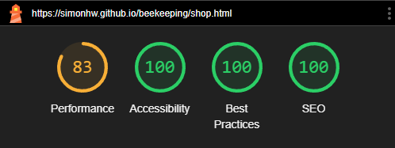

Form page:
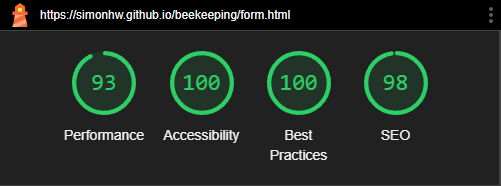

Thank You page:

404 page:
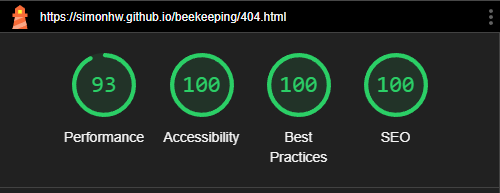

## Bugs
### Known Bugs
| # | Bug | Image | Plan to Solve |
| --- | --- | --- | --- |
| None | | | |

### Solved Bugs
| # | Bug | Image | Solution |
| --- | --- | --- | --- |
| 1 | While creating the navbar unordered list, there was an unspecified left padding of 40px discovered which was pushing the nav links visually off center. |  | The solution was to force all padding for the element to 0px in the CSS stylesheet. |
|2|The first element in the header (the div containing the navbar) has a value of 5px for margin-top. This seemed to result in pushing the entire header down leaving an empty white space equal to 5px in height. |  | Adding the property `overflow:hidden` to the div resolved the problem. Solution found on [Stack Overflow](https://stackoverflow.com/questions/2680478/margin-top-push-outer-div-down) |
| 3 | When tilting the mobile screen or using larger width displays, the H1 element was finding itself positioned outside the limits of the header. |  | I set the parent div to `display: flex` to ensure it stayed positioned inside the header and also utilised `flex-grow: 2` to visually centre the H1 in the new flex layout. This also seemed to solve Bug #2 when removing the `overflow:hidden` property added above. |
| 4 | The four divs in the Why Become a Beekeeper section arrange themselves in a 2x2 grid for screen widths of 768px and greater; however, on some occasions only the fourth div wrapped onto the second row and was shown much larger than the other three divs. This bug was encountered on the Edge and Firefox browsers when viewed on a 26" monitor. |  | The `flex-basis` value for the divs was changed from a fixed pixel width to a percentage of the viewport width. The bug could not be replicated in testing after making this change. |
| 5 | When using Mozilla Firefox, the browser forced the first image on the homepage to shrink to ~ 0.25 times its intended size on screen sizes of 768px wide and greater. | [Mozilla Firefox Image](assets/images/readme/bugs/bug005-moz-image.PNG) [Mozilla Inspect Element Image](assets/images/readme/bugs/bug005-moz-inspect.PNG) | The existing CSS attributes of `width: 50%` and `width: 33%` for the images on tablet and desktop screen sizes respectively were changed to `min-width: 50%` and `min-width: 33%`. | 
| 6 | On Mozilla Firefox, the four images in the Why Become a Beekeeper section did not display at the expected size on desktop widths when compared to other browsers. | 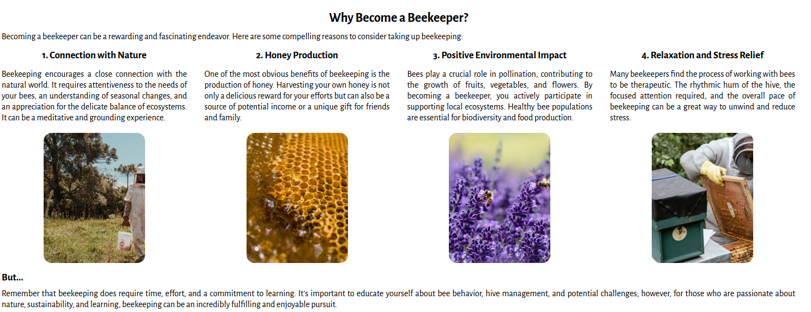 | Using the Inspect tool on Mozilla Firefox, I added the attribute of `-moz-available` and the desired image sizes were achieved. I leared that the previous width attribute of `-webkit-fill-available` only works on Chrome-based browers. |

## Credits

### Code Used
Code for the website footer was taken and adapted from the Code Institute Love Running Walkthrough Project.
- [Code Institute - Creating the Footer](https://github.com/Code-Institute-Solutions/love-running-v3/tree/main/3.7-creating-the-footer)

CSS code in the Why Become a Beekeeper section that makes the four divs arrange into a grid on smaller screen sizes was inspired by the Meetup Times section in the Code Institute Love Running Walkthrough Project.
- [Code Institute - Meetup Times](https://github.com/Code-Institute-Solutions/love-running-v3/tree/main/5.3-meetup-times)

Code in the Form page on line 11 was provided by CI Mentor Graeme Taylor during the second mentor meeting.

Code used to push the footer to the bottom of the Thank You page was found on the website 30 Second of Code.
- [30secondsofcode.org - Footer at the Bottom](https://www.30secondsofcode.org/css/s/footer-at-the-bottom/)

### Content
All code content was written by Simon Henleywillis unless otherwise specified above.

Paragraph text content was generated by ChatGPT and either used as-is or edited by Simon Henleywillis. 

ChatGPT Prompts: [Beekeeping: A Buzzing Hobby](https://chat.openai.com/c/bfaa4756-e755-4300-8aa0-5cff9b9cc20b) ~ [Bee Importance Unveiled](https://chat.openai.com/c/f0fd6c9d-5851-4e78-9275-83b556ab52e9) ~ [Irish Honey Bee Info](https://chat.openai.com/c/a34d83b8-4d55-42c0-b478-e94abeb4d8de)

### Media
All images were found on [Pexels](https://www.pexels.com/), [Unsplash](https://unsplash.com/license), and [Flaticon](https://www.flaticon.com/). The Pexels website states that "*All photos and videos on Pexels can be downloaded and used for free*", Unsplash states "*Unsplash photos are made to be used freely. Our license reflects that.*", and Flaticon states "*Our license allows you to use the content: For commercial and personal projects.*"

- Header Image: [A Beehive in the Garden](https://www.pexels.com/photo/a-beehive-in-the-garden-18014793/)
- Index Page: [Three People in White Suit](https://www.pexels.com/photo/three-people-in-white-suit-2260935/) ~ [A bee is sitting on top of a pink flower](https://www.pexels.com/photo/a-bee-is-sitting-on-top-of-a-pink-flower-17619735/) ~ [Man harvesting honey in apiary with bees](https://www.pexels.com/photo/man-harvesting-honey-in-apiary-with-bees-5247943/) ~ [Honey in Jars on Shelves](https://www.pexels.com/photo/honey-in-jars-on-shelves-12370134/)
- Courses Page: [Women Standing on the Grass While Holding a Bucket](https://www.pexels.com/photo/women-standing-on-the-grass-while-holding-a-bucket-2260936/) ~ [Close-up of a Honeycomb Filled with Honey](https://www.pexels.com/photo/close-up-of-a-honeycomb-filled-with-honey-11655535/) ~ [Bees on Purple Flower](https://www.pexels.com/photo/bees-on-purple-flower-164470/) ~ [Crop man harvesting honey in countryside area](https://www.pexels.com/photo/crop-man-harvesting-honey-in-countryside-area-5247947/)
- Shop Page: [Honey on Glass Jars](https://www.pexels.com/photo/honey-on-glass-jars-13246534/) ~ [bee person planting](https://unsplash.com/photos/bee-person-planting-8_WZU5xKFKk) ~ [Beehives on a Grass Field](https://www.pexels.com/photo/beehives-on-a-grass-field-17543926/) ~ [A Man in a Beekeeper Suit Near Blue Wooden Crates](https://www.pexels.com/photo/a-man-in-a-beekeeper-suit-near-blue-wooden-crates-4505623/) ~ [Close-Up Photo of an Empty Glass Jar on a White Surface](https://www.pexels.com/photo/close-up-photo-of-an-empty-glass-jar-on-a-white-surface-7604265/)
- 404 Page: [Cartoon Beehive](https://www.flaticon.com/free-icon/beehive_9421227)

## Acknowledgements
I would like to Acknowledge the following people for their help and support during the completion of my first portfolio project.
- My Code Institute mentor [Graeme Taylor](https://github.com/G-Taylor) who gave great encouragement and advice throughout. 
- [Creating Your First README - Kera Cudmore](https://github.com/kera-cudmore/readme-examples)
- Robin Hublard for his moral support and friendship.